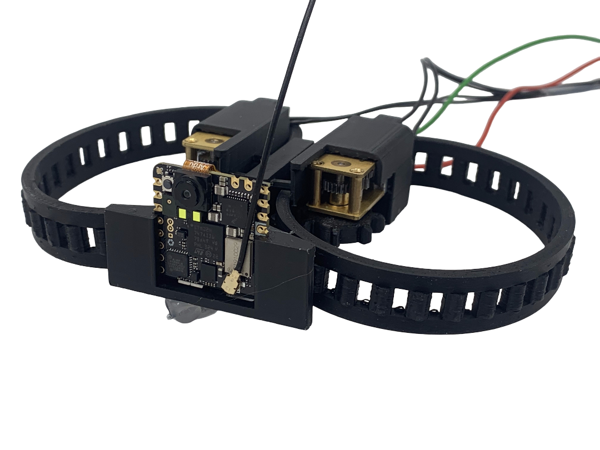
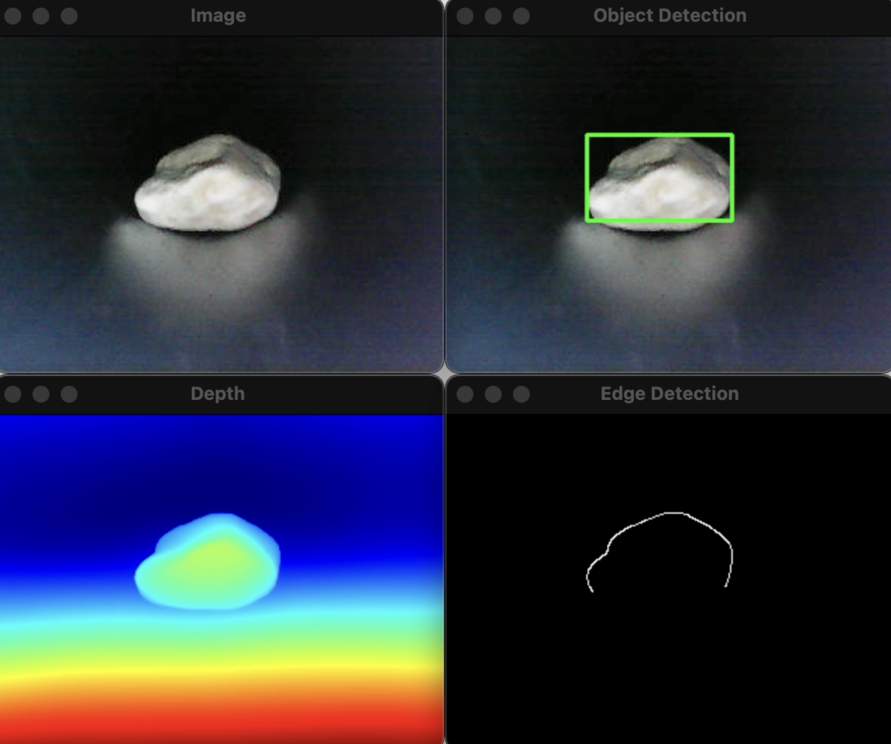
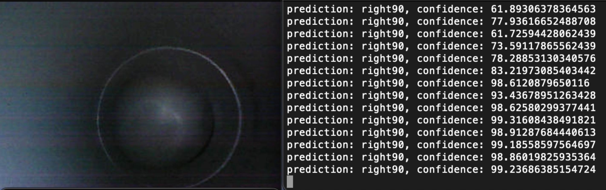
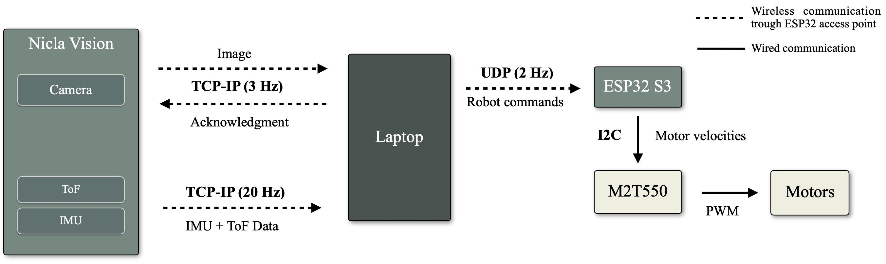

# Vision-Based Perception and Control for a Pipe Inspection Robot

This repository contains the code developed for a vision-based perception and control system for a pipe inspection robot.

The project demonstrates how a robot equipped with a **monocular camera, and time-of-flight sensor** can navigate inside pipe networks, estimate its position, and detect obstructions using computer vision.

 

## Overview

The system runs on a robot equipped with:

- Camera (Nicla Vision)
- Time-of-flight distance sensor
- Differential drive tracks

A laptop runs the main perception and control algorithms while communicating with the robot through WiFi.

## Main Features

### Pipe Turn Detection and Navigation

A deep learning classifier predicts the direction of upcoming pipe turns (left/right, 45° or 90°).  
Using this prediction together with distance measurements, the robot performs **differential control** to successfully navigate tight turns.

### Junction Detection and Mapping

Pipe junctions are detected using computer vision (Hough circle detection).  
These detections allow the system to:

- Estimate the distance to junctions
- Update the robot position
- Incrementally build a **topological map of the pipe network**

### Obstruction Detection

A monocular depth estimation model (Depth-Anything-V2: https://github.com/DepthAnything/Depth-Anything-V2) is used to detect objects blocking the pipe.  
Depth gradients are used to identify object contours and generate bounding boxes around potential obstructions.

## System Architecture

The system consists of:

- **Embedded hardware** on the robot (camera, IMU, ToF sensor)
- **ESP32 motor controller**
- **Python server** running perception and control algorithms

## Example Capabilities

The system enables a robot to:

- Navigate pipe turns autonomously
- Detect pipe junctions
- Estimate its position in the network
- Build a simple map of the pipe layout
- Detect objects blocking the pipe

## Project Context

This project was developed as part of a **Master Thesis in Robotics at EPFL** on vision-based perception and control for pipe inspection robots.
